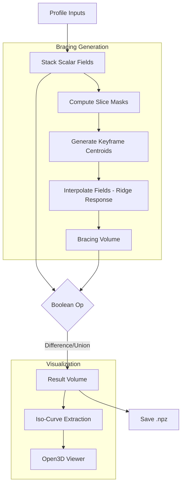

# Narnia — SDF Bracing Post-Processing

SDF-based architectural post-processing pipeline for generating internal bracing structures within a given profile volume.

## Quick start (Windows)

1.  **Environment Setup**: Ensure `conda` environment is active with `numpy`, `scipy`, `sklearn`, `open3d`, `contourpy`.
2.  **Run Pipeline**:
    ```bash
    python main.py
    ```
3.  **Key Toggles** (in `main.py`):
    - `GENERATE_BRACING`: Set `True` to generate new bracing fields instead of loading from JSON.
    - `LAUNCH_VIEWER`: Open the interactive Open3D GUI.
    - `SAVE_RESULTS`: Save processed fields to `.npz`.

## Core Logic

The pipeline operates on stacked 2D Scalar Fields (SDF representation).

1.  **Profile Input**: Reads a stack of 2D slices defining the outer shell (Profile).
2.  **Bracing Generation** (Logic in `core.py`):
    - **Method**: Voronoi-based Ridge Response.
    - **Keyframe Blending**: Centroids are generated only at key frames (start/end or specified intervals) using K-Means on the slice mask.
    - **Interpolation**: Bracing fields are interpolated smoothly between key frames (`generate_bracing_keyfield_blend`).
    - **Formula**: `B = exp(-(dist_diff / sigma)^2) - tau`. This creates smooth ridge-like structures equidistant from centroids.
3.  **Boolean Operations**: Combines Profile and Bracing fields (Difference, Union, Intersection).
4.  **Iso-Curve Extraction**: Uses `contourpy` to extract high-quality 2D vector curves for visualization/export.

## Module Structure

- **`core.py`**: Pure math/algorithm implementation.
    - `stack_scalar_fields`: JSON parsing.
    - `generate_centroids`: K-Means logic.
    - `generate_bracing_keyfield_blend`: Main bracing generation algorithm.
    - `compute_sf_operation`: SDF booleans.
    - `iso_curves_for_slice_2d`: Curve extraction.
- **`narnia_vis.py`**: Open3D GUI application. Handles rendering, sliders, and interactive updates.
- **`main.py`**: Pipeline entry point. Loads data, runs core algorithms (if configured), saves results, launches viewer.
- **`vis_utils.py` / `vis_widgets.py`**: Helper utilities for rendering and GUI constituents.

## Data & I/O

- **Input**: JSON files containing flattened scalar field arrays (`scalar_field_values_X`).
- **Output**: `.npz` archives containing:
    - `result_fields`: Final 3D volume (stacked 2D fields).
    - `profile_fields`, `bracing_fields`: Intermediate volumes.
    - Metadata: `bounds_min`, `bounds_max`, `nx`, `ny`.

## Developer Notes

- `core.py` functions use **Type Hints** for clarity.
- Open3D GUI context is created only inside `run_app` to avoid import-time side effects.
- Threading is limited (via `threadpool_limits`) to prevent system freezes during heavy NumPy/SciPy operations.

## Workflow Diagram


