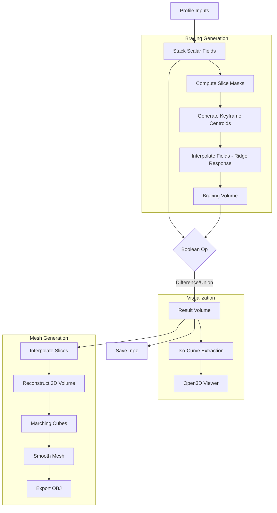

# Narnia — SDF Bracing & Mesh Generation

Modular Python pipeline for generating internal bracing structures from scalar fields and converting them to triangle meshes for CAD/Grasshopper integration.

## Quick Start (Windows)

1. **Environment Setup**: Activate conda environment with required packages:
   ```bash
   conda activate narnia  # or your environment name
   ```

2. **Run GUI Application**:
   ```bash
   python main.py
   ```

3. **Generate Mesh from NPZ** (CLI):
   ```bash
   # Using stable production tool
   python MeshFromNPZ.py --npz output/processed_sdf_results.npz --field profile_fields --iso 0.0 --verbose
   
   # OR using enhanced core-based tool (with smoothing)
   python examples/grasshopper_mesh_core.py --npz output/results.npz --smooth taubin --iterations 5
   ```

4. **Python API** (Scripts/Notebooks):
   ```python
   from core import interpolate_slices, reconstruct_3d_volume, generate_mesh_marching_cubes
   
   # See examples/python_api_demo.py for complete workflows
   ```

---

## Project Structure (Post Phase 1-6 Refactoring)

```
Narnia_Draft/
├── core/                          # Modular core package
│   ├── __init__.py               # Public API (22 exported functions)
│   ├── data_utils.py             # NPZ/JSON loading, grid inference
│   ├── curves.py                 # ISO-curve extraction
│   ├── sdf_operations.py         # Boolean operations on SDFs
│   ├── bracing_generator.py      # Voronoi-based bracing generation
│   ├── postprocess.py            # Morphological cleaning, temporal smoothing
│   ├── mesh_generator.py         # Marching cubes, smoothing, OBJ export
│   └── README.md                 # Module documentation
│
├── gui/                           # GUI package (Open3D viewer)
│   ├── __init__.py
│   ├── widgets.py                # GUI widget factories
│   └── mesh_builders.py          # Mesh building utilities for GUI
│
├── examples/                      # Usage examples
│   ├── grasshopper_mesh_core.py  # Enhanced CLI tool (core-based, with smoothing)
│   └── python_api_demo.py        # Library usage examples
│
├── MeshFromNPZ.py                 # STABLE PRODUCTION CLI TOOL (Grasshopper-proven)
├── main.py                        # GUI application entry point
├── narnia_vis.py                  # Open3D GUI implementation
├── vis_utils.py                   # Rendering utilities
├── README.md                      # This file
└── requirements.txt               # Python dependencies
```

**Key Design Principle**: `MeshFromNPZ.py` is the production-proven tool used in Grasshopper workflows. `examples/grasshopper_mesh_core.py` demonstrates core package integration for testing new features.

---

## Grasshopper Integration

### Recommended Workflow (Stable)

Use `MeshFromNPZ.py` as a subprocess CLI tool from Grasshopper Python component:

```python
import os
import hashlib
import subprocess
import Rhino.Geometry as rg

# -------------------------
# Configuration
# -------------------------
NPZ = "D:/path/to/data.npz"                    # Input NPZ file
NarniaPy = "C:/Users/You/.conda/envs/narnia/python.exe"  # Narnia Python
ScriptPath = "D:/path/to/Narnia_Draft/MeshFromNPZ.py"
OutDir = "D:/path/to/cache"                    # Cache directory
Field = "profile_fields"                        # or "bracing_fields", "result_fields"
Interp = 2                                      # Slice interpolations (0-5)
Iso = None                                      # Override iso_level (or None)
Height = None                                   # Override total_height (or None)
Run = True                                      # Toggle to generate

# -------------------------
# Helper: Clean environment for subprocess
# -------------------------
def _clean_env_for_external_python(python_exe):
    env = os.environ.copy()
    for k in list(env.keys()):
        if k.upper().startswith("PYTHON"):
            env.pop(k, None)
    
    conda_prefix = os.path.dirname(os.path.dirname(python_exe))
    dll_dirs = [
        conda_prefix,
        os.path.join(conda_prefix, "Library", "bin"),
        os.path.join(conda_prefix, "Scripts"),
    ]
    env["PATH"] = ";".join([d for d in dll_dirs if os.path.exists(d)] + [env.get("PATH", "")])
    return env

# -------------------------
# Build command and run
# -------------------------
if Run:
    # Generate unique cache key
    npz_stat = os.stat(NPZ)
    cache_key = hashlib.sha1(
        f"{NPZ}:{npz_stat.st_mtime_ns}:{npz_stat.st_size}:{Field}:{Interp}:{Iso}:{Height}".encode()
    ).hexdigest()
    
    obj_path = os.path.join(OutDir, f"mesh_{cache_key}.obj")
    
    if not os.path.exists(obj_path):
        cmd = [
            NarniaPy, ScriptPath,
            "--npz", NPZ,
            "--field", Field,
            "--interp", str(int(Interp)),
            "--out", obj_path
        ]
        if Iso is not None:
            cmd += ["--iso", str(Iso)]
        if Height is not None:
            cmd += ["--height", str(Height)]
        
        env = _clean_env_for_external_python(NarniaPy)
        
        result = subprocess.run(cmd, capture_output=True, text=True, shell=False, env=env)
        
        if result.returncode != 0:
            raise Exception(f"MeshFromNPZ failed:\n{result.stderr}")
    
    # Parse OBJ and create Rhino mesh
    M = parse_obj_to_rhino_mesh(obj_path)  # Your OBJ parser
```

**Benefits**:
- ✅ Caching: Same inputs → same output path (instant on re-compute)
- ✅ Deterministic: Subprocess isolation prevents GH Python conflicts
- ✅ Clean stdout: Only prints OBJ path on success (easy to capture)
- ✅ Error handling: All errors go to stderr with exit codes

### Experimental Workflow (Core Package)

Test new features (e.g., mesh smoothing) using `examples/grasshopper_mesh_core.py`:

```python
# Same subprocess pattern, different script:
ScriptPath = "D:/path/to/Narnia_Draft/examples/grasshopper_mesh_core.py"

cmd = [
    NarniaPy, ScriptPath,
    "--npz", NPZ,
    "--field", "profile_fields",
    "--smooth", "taubin",      # NEW: Smoothing (laplacian/taubin/combined)
    "--iterations", "5",       # NEW: Smoothing iterations
    "--out", obj_path
]
```

**Note**: This requires Open3D in your conda environment. Falls back gracefully if unavailable.

---

## NPZ File Format

NPZ files contain preprocessed scalar fields with metadata:

| Key | Shape | Description |
|-----|-------|-------------|
| `profile_fields` | `(num_slices, nx*ny)` | Outer shell SDF (flattened 2D slices) |
| `bracing_fields` | `(num_slices, nx*ny)` | Internal bracing SDF (flattened 2D slices) |
| `result_fields` | `(num_slices, nx*ny)` | Combined/processed SDF (flattened 2D slices) |
| `iso_level` | `()` scalar | Iso-surface threshold (default: 0.0) |
| `total_height` | `()` scalar | Z-axis extent (default: 10.0) |
| `bounds_min` | `(2,)` or `(3,)` | XY(Z) minimum bounds |
| `bounds_max` | `(2,)` or `(3,)` | XY(Z) maximum bounds |
| `slice_count` | `()` scalar | Number of slices (optional) |

**Field Convention**: Flattened `(num_slices, N)` where `N = nx * ny` (must be perfect square).

**SDF Convention**: Negative values = inside, positive values = outside, zero = boundary.

---

## CLI Usage Examples

### MeshFromNPZ.py (Stable Tool)

```bash
# Basic usage
python MeshFromNPZ.py --npz output/results.npz --field profile_fields

# With overrides
python MeshFromNPZ.py --npz data.npz --field bracing_fields --iso 0.1 --height 12.0 --interp 3

# Verbose mode (debug)
python MeshFromNPZ.py --npz data.npz --verbose

# Custom output path
python MeshFromNPZ.py --npz data.npz --out custom_mesh.obj
```

### grasshopper_mesh_core.py (Enhanced Tool)

```bash
# With smoothing
python examples/grasshopper_mesh_core.py --npz data.npz --smooth taubin --iterations 5

# Laplacian smoothing (faster, may shrink)
python examples/grasshopper_mesh_core.py --npz data.npz --smooth laplacian --iterations 10

# Combined (Laplacian + Taubin)
python examples/grasshopper_mesh_core.py --npz data.npz --smooth combined --iterations 3
```

---

## Python API Examples

### Load NPZ and Generate Mesh

```python
from core import interpolate_slices, reconstruct_3d_volume, generate_mesh_marching_cubes, export_mesh_obj
import numpy as np

# Load NPZ
data = np.load("output/results.npz")
field_data = data["profile_fields"]

# Reshape if flattened: (S, N) → (S, n, n)
if field_data.ndim == 2:
    num_slices, N = field_data.shape
    n = int(np.sqrt(N))
    field_data = field_data.reshape(num_slices, n, n)

# Interpolate slices
interpolated = interpolate_slices(field_data, num_interpolations=2)

# Reconstruct 3D volume
bounds_min = np.array([0, 0, 0])
bounds_max = np.array([100, 100, 10])
nz, ny, nx = interpolated.shape
grid_data = reconstruct_3d_volume(interpolated, nx, ny, bounds_min, bounds_max)

# Generate mesh
result = generate_mesh_marching_cubes(
    grid_data["volume"],
    grid_data["spacing"],
    grid_data["origin"],
    iso_level=0.0
)

if result:
    vertices, faces = result
    export_mesh_obj({"vertices": vertices, "triangles": faces}, "output.obj")
```

### Generate Bracing from JSON

```python
from core import (stack_scalar_fields, meta_data_info, infer_grid_from_scalar_fields,
                  generate_bracing_keyfield_blend, postprocess_bracing_fields)
import json
import numpy as np

# Load JSON
with open("data.json") as f:
    data_dict = json.load(f)

# Extract fields
profile_fields_2d, _ = stack_scalar_fields(data_dict, prefix="scalar_field_values_")
iso_level, slice_count, bounds_max, bounds_min = meta_data_info(data_dict)
num_fields, nx, ny = infer_grid_from_scalar_fields(profile_fields_2d)

# Generate bracing with keyfield blending
keys_config = [(0, 3), (num_fields//2, 5), (num_fields-1, 4)]  # Variable centroids
bracing = generate_bracing_keyfield_blend(
    profile_fields_2d, iso_level, nx, ny, keys_config, smooth=0.5, sigma=5.0
)

# Post-process
cleaned = postprocess_bracing_fields(bracing, profile_fields_2d, iso_level)

# Save to NPZ for meshing
np.savez("output_bracing.npz", profile_fields=profile_fields_2d, bracing_fields=cleaned)
```

See **[examples/python_api_demo.py](examples/python_api_demo.py)** for complete workflows.

---

## Core Package API

See **[core/README.md](core/README.md)** for detailed module documentation.

**Quick Reference**:

```python
from core import (
    # Data loading
    stack_scalar_fields,           # JSON → scalar fields
    meta_data_info,                # Extract metadata
    infer_grid_from_scalar_fields, # Auto-detect nx, ny
    
    # Mesh generation
    interpolate_slices,            # Densify Z-axis
    reconstruct_3d_volume,         # 2D slices → 3D volume
    generate_mesh_marching_cubes,  # Volume → triangle mesh
    smooth_mesh,                   # Laplacian/Taubin smoothing
    export_mesh_obj,               # Save to OBJ file
    
    # Bracing generation
    generate_bracing_static,       # K-means Voronoi bracing
    generate_bracing_keyfield_blend, # Variable centroid blending
    
    # Post-processing
    postprocess_bracing_fields,    # Morphological cleaning + temporal smoothing
    
    # Visualization
    iso_curves_for_slice_2d,       # Extract 2D curves
    
    # SDF operations
    compute_sf_operation,          # Boolean ops (union/subtract/intersect)
)
```

---

## Core Logic

The pipeline operates on **stacked 2D Scalar Fields** (SDF representation).

1. **Profile Input**: Reads a stack of 2D slices defining the outer shell (Profile).
2. **Bracing Generation**:
   - **Method**: Voronoi-based Ridge Response (see [core/bracing_generator.py](core/bracing_generator.py))
   - **Keyframe Blending**: Centroids generated at key slices using K-Means, interpolated smoothly
   - **Formula**: `B = exp(-(V/σ)²) - τ` creates smooth ridge-like structures
3. **Boolean Operations**: Combines Profile and Bracing fields (Difference, Union, Intersection)
4. **Iso-Curve Extraction**: Uses `contourpy` for high-quality 2D vector curves
5. **Mesh Generation**: Marching cubes algorithm extracts 3D iso-surface

---

## Module Structure (Legacy References)

- `core.py` functions use **Type Hints** for clarity.
- Open3D GUI context is created only inside `run_app` to avoid import-time side effects.
- Threading is limited (via `threadpool_limits`) to prevent system freezes during heavy NumPy/SciPy operations.
- Refactored in Phases 1-6 (see `.github/copilot-instructions.md` for history).

## Dependencies

Install via conda:
```bash
conda create -n narnia python=3.10
conda activate narnia
conda install numpy scipy scikit-learn scikit-image open3d -c conda-forge
pip install contourpy
```

Or use `requirements.txt`:
```bash
pip install -r requirements.txt
```

## Workflow Diagram



## Changelog

### Phase 1-6 Refactoring (Jan 2026)
- ✅ **Phase 1**: Extracted mesh generation to `core/mesh_generator.py`
- ✅ **Phase 2**: Split `core/sdf_operations.py` into focused modules (data_utils, curves, bracing_generator, postprocess)
- ✅ **Phase 5**: Organized GUI helpers into `gui/` package
- ✅ **Phase 6**: Documentation, examples, and Grasshopper integration guide
- ✅ Preserved `MeshFromNPZ.py` as stable production tool
- ✅ Created `examples/grasshopper_mesh_core.py` for testing new features
- ✅ Comprehensive API documentation in `core/README.md`

See `.github/copilot-instructions.md` for detailed refactoring notes.

