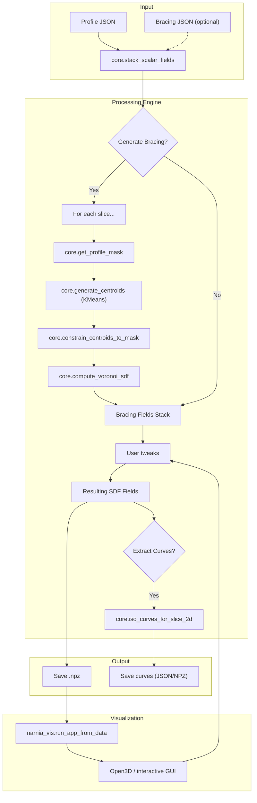

# Narnia — SDF Bracing Post-Processing

Short overview
- Post-processing pipeline that reads volumetric Signed Distance Field (SDF) stacks (JSON), performs boolean SDF ops, generates centroid/Voronoi bracing, and extracts iso-curves for CAD/visualization.

Quick start (Windows)
- From project root:
    python main.py
- Key toggles in `main.py`: GENERATE_BRACING, NUM_CENTROIDS, SAVE_RESULTS, EXTRACT_CURVES.
- Viewer configuration in `vis_utils.py`: PREFERRED_MONITOR_INDEX, HEADLESS_MODE.

Core modules
- main.py — pipeline launcher, CLI/headless execution. Imports `vis_utils` early for environment setup.
- core.py — parsing, stacking, boolean ops, mask/centroid generation, Voronoi SDF, iso-curve extraction.
- narnia_vis.py — Main viewer application class focusing on layout and event orchestration.
- vis_utils.py — Environment setup (threading, GL), user configuration, and geometry/data transformation logic.
- vis_widgets.py — Reusable Open3D GUI component factories.
- notebook_test/ — interactive notebooks and prototyping helpers.

Data formats
- Input JSON keys: `iso_level`, `slice_count`, `bounds_min`, `bounds_max`, `scalar_field_values_{i}`.
- Scalar fields: flattened 1D arrays of length nx*ny; grid assumed square (nx==ny).
- Outputs: `output/processed_sdf_results.npz` (result fields, iso levels) and optional curves JSON/NPZ.

Workflow (conceptual)
- Load profile JSON (required) and bracing JSON (optional).
- Optionally generate bracing per-slice from profile: mask -> KMeans centroids -> constrain -> Voronoi SDF.
- Validate shapes, apply iso offsets.
- Boolean SDF operation (difference/union/intersection).
- Optional iso-curve extraction per slice (matplotlib contour).
- Save .npz and optionally launch viewer.

Configuration & Performance
- **vis_utils.py**: Centralizes system setup.
    - `PREFERRED_MONITOR_INDEX`: Set to 1 for external dGPU, 0 for laptop iGPU.
    - `HEADLESS_MODE`: Set to True to skip viewer launch (useful for batch processing or if viewer freezes).
    - `FORCE_SOFTWARE_GL`: Set to True to attempt CPU rendering (requires Mesa).
    - Thread capping: Automatically sets `OMP_NUM_THREADS` etc. to "1" to prevent system freezes on Windows.
- **Performance**: For dGPU systems, you can manually increase thread limits in `vis_utils.py` if stability is confirmed.

Developer notes
- Validate grid: call `core.infer_grid_from_scalar_fields()` early.
- System Diagnostics: `vis_utils.print_system_diagnostics()` runs on startup to help debug monitor detection.
- Iso-curve extraction closes matplotlib figures to avoid leaks.
- Keep previous centroids between slices to stabilize KMeans (`prev_centroids` in main.py).

Mermaid workflow

